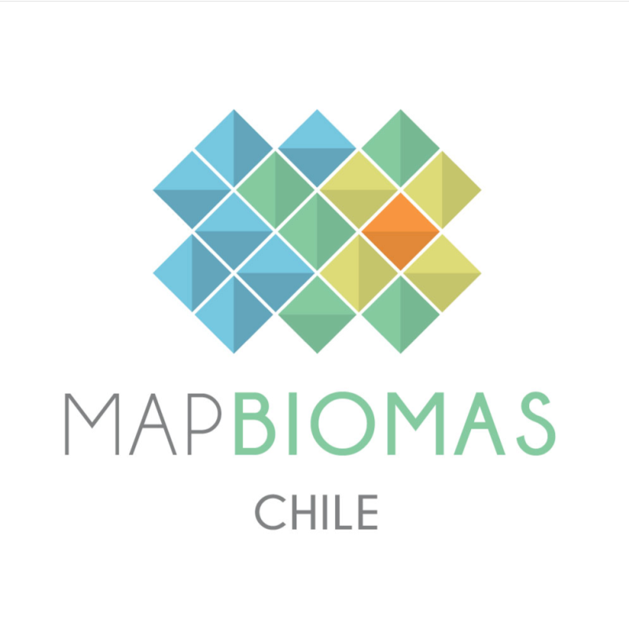

# chile-all

<table>
  <tr>
    <td valign="middle">
      
    </td>
    <td valign="middle">
      <strong style="font-size: 42px;">MapBiomas Chile Project</strong>
    </td>
  </tr>
</table>

## 🔗 Access

- 🧭 **Platform**: [View the product on the MapBiomas platform](https://plataforma.mapbiomas.org/coverage/coverage_lclu?t[regionKey]=chile&t[ids][]=20-1-1&t[divisionCategoryId]=2&tl[id]=1&tl[themeKey]=coverage&tl[subthemeKey]=coverage_lclu&tl[pixelValues][]=59&tl[pixelValues][]=60&tl[pixelValues][]=67&tl[pixelValues][]=11&tl[pixelValues][]=12&tl[pixelValues][]=29&tl[pixelValues][]=63&tl[pixelValues][]=66&tl[pixelValues][]=9&tl[pixelValues][]=15&tl[pixelValues][]=18&tl[pixelValues][]=33&tl[pixelValues][]=34&tl[pixelValues][]=27&tl[pixelValues][]=23&tl[pixelValues][]=24&tl[pixelValues][]=25&tl[pixelValues][]=61&tl[legendKey]=default&tl[year]=2024)
- 🌐 **Website**: [Visit the MapBiomas Chile project website](https://chile.mapbiomas.org/)

## 📦 Products

We are currently developing 3 associated products:

- 🗺️ [**chile-coverage**](https://github.com/mapbiomas/chile-coverage): focused on Land Use and Land Cover mapping, currently in its **third version**.
- 🔥 [**chile-fire**](https://github.com/mapbiomas/chile-fire): focused on fire identification, currently in its **first version**.
- 💧 [**chile-water**](https://github.com/mapbiomas/chile-water): focused on water body identification, currently in its **first version**.

## 🤝 Contact

For inquiries, contact us at: **chilemapbiomas@gmail.com**
